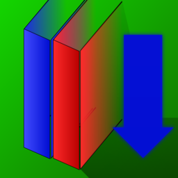

# bookmark-dlp
Utility program for downloading bookmarked YouTube links using yt-dlp. It replicates the folder structure of your Chrome/Brave/Firefox/etc. bookmarks and calls yt-dlp to download all YouTube videos among the bookmarks.



## Contents

- [Status](#status)
- [Usage](#usage)
- [Installation & How to get](#installation--how-to-get)
   * [Fedora](#fedora)
   * [Arch (AUR)](#arch-aur)
   * [Standalone releases](#standalone-releases)
   * [Additional releases](#additional-releases)
- [Limitations](#limitations)
- [CLI Usage](#cli-usage)
- [How it works](#how-it-works)
- [More details](#more-details)
   * [Locations for files](#locations-for-files)
      + [Config for bookmark-dlp:](#config-for-bookmark-dlp)
      + [yt-dlp binary locations:](#yt-dlp-binary-locations)
      + [yt-dlp.config is sought in the following locations:](#yt-dlpconfig-is-sought-in-the-following-locations)
- [Releases](#releases)
   * [Aims](#aims)
   * [Signatures, hashes and integrity checks](#signatures-hashes-and-integrity-checks)
   * [Build instructions](#build-instructions)


## Status <a name="status"/>
[](https://github.com/Neurofibromin/bookmark-dlp/actions/workflows/prerelease.yml)
[](https://github.com/Neurofibromin/bookmark-dlp/actions/workflows/dotnet.yml)
[](https://github.com/Neurofibromin/bookmark-dlp/actions/workflows/nuget.yml)
[](https://github.com/Neurofibromin/bookmark-dlp/actions/workflows/codeql-analysis.yml)
[](https://copr.fedorainfracloud.org/coprs/neurofibromin/bookmark-dlp/package/bookmark-dlp/)
[](https://repology.org/project/bookmark-dlp/versions)

## Usage <a name="usage"/>
- Run the executable and select your browser profile to auto-import bookmarks, or load a Google Takeout Chrome bookmarks HTML file.
- Choose an output folder for the downloaded files.
- If necessary, specify the location of the yt-dlp executable in the settings.
- CLI usage options are available.

## Installation & How to get <a name="installation--how-to-get"/>
<em>Make sure yt-dlp is installed: If you do not have the newest version you can get it [here](https://github.com/yt-dlp/yt-dlp#installation).</em>
Download the executable for your system from [releases](https://github.com/Neurofibromin/bookmark-dlp/releases/download/latest). bookmark-dlp is packaged in [some](https://repology.org/project/bookmark-dlp/versions) platforms native package distribution.

### Fedora <a name="fedora"/>
```shell
sudo dnf copr enable neurofibromin/bookmark-dlp
sudo dnf install bookmark-dlp
```

### Arch (AUR) <a name="arch-aur"/>
```shell
yay bookmark-dlp
```

### Standalone releases <a name="standalone-releases"/>
| package      |                                                        x64                                                        | x86                                                                                                                                              | arm64                                                                                                                                                   |
| :--- |:-----------------------------------------------------------------------------------------------------------------:| :---: | :---: |
| Windows | [Download](https://github.com/Neurofibromin/bookmark-dlp/releases/download/latest/bookmark-dlp-win-x64-0.5.0.exe) | [Download](https://github.com/Neurofibromin/bookmark-dlp/releases/download/latest/bookmark-dlp-win-x86-0.5.0.exe) | [Download](https://github.com/Neurofibromin/bookmark-dlp/releases/download/latest/bookmark-dlp-win-arm64-0.5.0.exe) |
| Linux |  [Download](https://github.com/Neurofibromin/bookmark-dlp/releases/download/latest/bookmark-dlp-linux-x64-0.5.0)  | N/A | [Download](https://github.com/Neurofibromin/bookmark-dlp/releases/download/latest/bookmark-dlp-linux-arm64-0.5.0) |
| OSX (semi-supported) |   [Download](https://github.com/Neurofibromin/bookmark-dlp/releases/download/latest/bookmark-dlp-osx-x64-0.5.0)   | N/A | [arm64](https://github.com/Neurofibromin/bookmark-dlp/releases/download/latest/bookmark-dlp-osx-arm64-0.5.0) |

### Additional releases <a name="additional-releases"/>
Linux Installers: <br/>

| package      | x64                                                                                                                                                   | arm64                                                                                                                                                   |
| :--- | :---: | :---: |
| Flatpak	     | 		[Download](https://github.com/Neurofibromin/bookmark-dlp/releases/download/latest/bookmark-dlp-0.5.0-1.x86_64.flatpak)		                            | 	[Download](https://github.com/Neurofibromin/bookmark-dlp/releases/download/latest/bookmark-dlp-0.5.0-1.aarch64.flatpak)			   |
| RPM	         | 		[Download](https://github.com/Neurofibromin/bookmark-dlp/releases/download/latest/bookmark-dlp_0.5.0-1.x86_64.rpm)		           | 	N/A			                                                                                                                                                 |
| DEB	         | 		[Download](https://github.com/Neurofibromin/bookmark-dlp/releases/download/latest/bookmark-dlp_0.5.0-1_amd64.deb)		             | 	[Download](https://github.com/Neurofibromin/bookmark-dlp/releases/download/latest/bookmark-dlp_0.5.0-1_arm64.deb)			               |
| AppImage	    | 		[Download](https://github.com/Neurofibromin/bookmark-dlp/releases/download/latest/bookmark-dlp-0.5.0-1.x86_64.AppImage)		 | 	[Download](https://github.com/Neurofibromin/bookmark-dlp/releases/download/latest/bookmark-dlp-0.5.0-1.aarch64.AppImage)			 |


## Limitations <a name="limitations"/>
- Currently "exports" from browsers do not work.
- Output folder cannot be a network folder on some platforms.

## CLI Usage <a name="cli-usage"/>
Put the Bookmarks.html and the **yt-dlp(.exe) into the same directory as the executable**. Get the Bookmarks.html from a Google takeout.<br/>

Run the executable: <br/>
Windows: in CMD or PowerShell: `bookmark-dlp-0.5.0.exe --interactive` <br/>
Linux: in terminal in the directory: `./bookmark-dlp-linux-x64-0.5.0 --interactive`
More flags/usage info: `./bookmark-dlp --help`

## How it works <a name="how-it-works"/>
1. The program checks for a Bookmarks.html file in its root directory. If not found, it searches default locations for supported browsers.
2. It replicates the folder structure of the bookmarks bar on disk.
3. YouTube links are extracted from the bookmarks and organized into text files.
4. Helper scripts are generated for each folder to call yt-dlp for downloading.
5. Optional: Provide a yt-dlp.conf file in the program root directory for advanced configurations.

## More details <a name="more-details"/>
If a Bookmarks.html exists within its root directory/where it was called from, that is the default input file. Default locations for some browsers (see list of supported browsers) are checked, to find any browser profiles with bookmarks.<br/>
When a bookmark containing file is found or provided, the content is taken in, and the folder structure of the bookmarks bar is replicated on disk, in the chosen output directory (root(running) directory by default).
The youtube links in the given folder are written into a \${foldername}.txt file. Complex youtube links (not links for video, but for channels and playlists etc) can be included, but are excluded by default.<br/>
A helper script (.bat or .sh) is also generated for each folder. If a folder contains no links (and no files at all) it is deleted. The helper scripts are called, these in turn call yt-dlp. The presence of yt-dlp binaries is checked details at [Locations for files](#locations-for-files).
The scripts run one at a time, in sequence. I recommend also providing a **yt-dlp.conf file into program root** (running) directory, and enabling the archive function - that way bookmark-dlp can be run from the same directory again, and only new files get downloaded.
If the same directory is used for different profiles things can get written into same directories, but probably nothing should be lost.

### Locations for files <a name="locations-for-files"/>
#### Config for bookmark-dlp: <a name="config-for-bookmark-dlp"/>
1. local 
    1. `Path.Combine(Directory.GetCurrentDirectory(), "bookmark-dlp.conf")`
    2. `Path.Combine(AppDomain.CurrentDomain.BaseDirectory, "bookmark-dlp.conf")`
2. OS config directory
    * windows = `Path.Combine(System.Environment.GetFolderPath(Environment.SpecialFolder.LocalApplicationData), "bookmark-dlp\\bookmark-dlp.conf")`
    * linux = `Path.Combine(System.Environment.GetFolderPath(Environment.SpecialFolder.ApplicationData), "bookmark-dlp/bookmark-dlp.conf")`
    * osx = `Path.Combine(System.Environment.GetFolderPath(Environment.SpecialFolder.Personal), "bookmark-dlp/bookmark-dlp.conf")`

If no config is found at startup popup asks for location for new config file.

#### yt-dlp binary locations: <a name="yt-dlp-binary-locations"/>
1. program is called from
2. program executable is found in
3. chosen output folder
4. path

accepted filenames for the yt-dlp binary:
- osx: { "yt-dlp", "yt-dlp_macos", "yt-dlp_macos_legacy" }
- linux: {"yt-dlp", "yt-dlp_linux", "yt-dlp_linux_aarch64", "yt-dlp_linux_armv7l" }
- windows: "yt-dlp.exe"

#### yt-dlp.config is sought in the following locations: <a name="yt-dlpconfig-is-sought-in-the-following-locations"/>

https://github.com/yt-dlp/yt-dlp?tab=readme-ov-file#configuration

1. bookmark-dlp program is called from
2. yt-dlp executable is found in 
3. bookmark-dlp chosen output folder
4. bookmark-dlp executable is found in
5. yt-dlp default folder
    1. `${XDG_CONFIG_HOME}/yt-dlp.conf`
    2. `${XDG_CONFIG_HOME}/yt-dlp/config`
    3. `${XDG_CONFIG_HOME}/yt-dlp/config.txt`
    4. `${APPDATA}/yt-dlp.conf`
    5. `${APPDATA}/yt-dlp/config`
    6. `${APPDATA}/yt-dlp/config.txt`
    7. `~/yt-dlp.conf`
    8. `~/yt-dlp.conf.txt`
    9. `~/.yt-dlp/config`
    10. `~/.yt-dlp/config.txt`
    11. `/etc/yt-dlp.conf`
    12. `/etc/yt-dlp/config`
    13. `/etc/yt-dlp/config.txt`


## Releases <a name="releases"/>
Windows and linux compatible, written in C#, builds for x86 and ARM available. Flatpaks, DEB and RPM packages are also generated. Arch packagebuild is in the repo, but also available in the AUR.<br/>
Build your own: this project is open source

[Standalone releases](#standalone-releases)

[Additional releases](#additional-releases)

### Aims <a name="aims"/>
<br>CI/CD<br/>
- [ ] [OpenSuse Build Service](https://build.opensuse.org/package/show/home:Neurofibromin/bookmark-dlp)
- [ ] Nix
- [ ] Flathub
- [ ] Debian
- [x] [Arch/AUR](https://aur.archlinux.org/packages/bookmark-dlp)
- [x] [Fedora Copr](https://copr.fedorainfracloud.org/coprs/neurofibromin/bookmark-dlp/)
- [x] [Gitea mirror](N/A)
- [x] [sourceforge mirror](https://sourceforge.net/projects/bookmark-dlp/)
- [x] [NuGet](https://www.nuget.org/packages/nfbookmark)
- [x] innosetup
- [ ] winget
- [ ] chocolatey

<br>new features<br/>
- [x] start console and gui from same binary
- [x] better versioning
- [x] refactor bookmarks import to library
- [ ] tray icon
- [x] dot desktop file
- [ ] add manpages
- [x] logging
- [x] create project icon

<br>Increase support<br/>
- [ ] safari support
- [x] opera osx support
- [ ] bsd support
- [ ] docker
- [x] netcore3.1
- [ ] browsers installed as flatpaks
- [ ] sign appimage with pupnet
- [ ] Add screenshots to README.md
- [ ] Add manpage to .spec
- [ ] Add manpage to PKGBUILD
- [ ] Add manpage to .nix


### Signatures, hashes and integrity checks <a name="signatures-hashes-and-integrity-checks"/>

The following pgp keys are valid:

| Fingerprint | Description |
| ----------- | ----------- |
| 9F9BFE94618AD26667BD28214F671AFAD8D4428B | used in git and manually signed packages |
| 5C85EF4F34E089A04B2063A5833E01FC62E56779 | used in CICD pipelines to autosign packages where supported |

Keyservers:
- https://keys.openpgp.org/
- https://keyserver.ubuntu.com/
- http://pgp.mit.edu/

Public keys are also distributed with the build files.

SHA256 hashes for the binaries are produced in the GitHub workflow and found in checksum.txt under release assets.

The bookmark-dlp icons are licensed under [CC BY-NC-SA 4.0](http://creativecommons.org/licenses/by-nc-sa/4.0/).

### Build instructions <a name="build-instructions"/>
Install dependencies: [dotnet](https://dotnet.microsoft.com/en-us/download)
```
git clone -b master https://github.com/Neurofibromin/bookmark-dlp bookmark-dlp
cd bookmark-dlp
dotnet restore
dotnet publish bookmark-dlp/bookmark-dlp.csproj --configuration Release
```